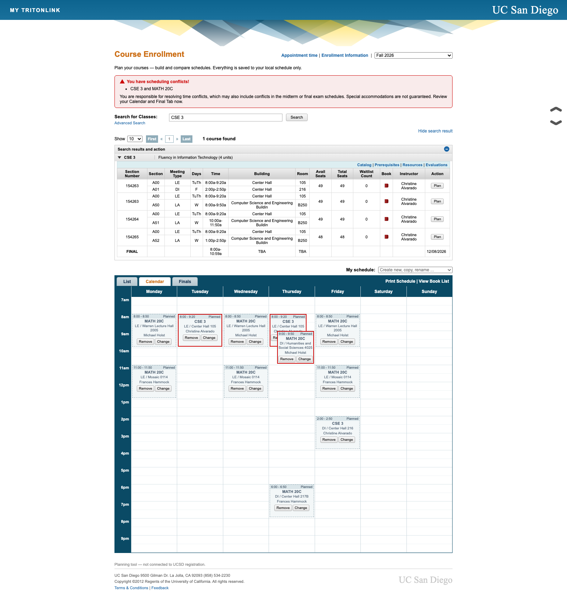

# WebReg Course Planner

UCSD's classic **WebReg**, brought back as a class-planning tool — for everyone who misses it now that TSS is the only option. It looks and works like the WebReg you know, loaded with **real Fall 2026 courses, professors, times, rooms, and total seat counts**.

## **https://sahirssharma.github.io/WebReg-Course-Planner/**

Just open the link. It runs entirely in your browser, and your planned schedule is saved privately on your own device.

---

## How I built this

Two hard problems: reproduce WebReg's exact interface, and get Fall 2026 data that only lives inside UCSD's new SAP system.

### 1. Reconstructing the WebReg UI

WebReg was already retired, so there was no live page to copy. I rebuilt it from primary sources — the UCSD Registrar's own "WebReg 2.0" demo deck and the colleges' enrollment guides — reconstructing the layout screen by screen and sampling the exact colors out of the screenshots. It's plain HTML, CSS, and vanilla JavaScript (no framework) to match the old ExtJS-era feel and stay dependency-free: the collapsible search drawers, the 13-column section grid, the enroll/plan dialogs, and the List / Calendar / Finals schedule views are all rendered client-side, including a weekly calendar grid that lays out overlapping blocks and flags time conflicts.



### 2. The data problem

The legacy public Schedule of Classes only goes through Summer 2026. Fall 2026 exists **only** in TSS — UCSD's new system — which is **SAP Student Lifecycle Management** behind an SAP Fiori launchpad, gated by SSO + Duo. And its own class-search screen is unreliable and crashes.

### 3. Reverse-engineering TSS's API

I wrote a Playwright script that opens a real Chromium window at the TSS login, waits for me to finish SSO + Duo, and captures the authenticated session. (A subtle bug: login detection had to key on a real `SAP_SESSIONID` cookie — the Fiori URL loads *before* authentication and kept false-positiving, closing the window mid-login.)

Since the search UI itself crashed, I didn't try to drive it. Instead I booted the Schedule-of-Classes Fiori app **headless** with the captured session and watched its network traffic. That exposed the real data source the launchpad never advertises: an **OData v4 service, `yucsd_con_module`**. I queried it directly — found the term value-help (Fall 2026 = year `2026`, period `2`), then paged the entity sets and dumped the whole term to disk: **1,768 courses, 8,431 section-events, 7,408 meeting times, and 7,107 instructor records** — bypassing the broken interface entirely.

### 4. Mapping SAP's data model to WebReg

SAP models a course as a "module" and its sections as "events" bundled into enrollment "packages" (a lecture with its discussion and lab). I wrote an importer that regroups these into WebReg's structure — lecture groups (A / B / C…), discussion rows (A01…), lab rows (A50…), and a final-exam row — deduping meetings that are shared across packages and parsing SAP's human-readable schedule strings like

```
Tu, Th 08:00 AM - 09:20 AM In Person @ Center Hall Room 105
Final Examination 12/08/2026 08:00 AM - 10:59 AM In Person
```

into structured days, times, rooms, and final-exam entries.

### 5. From a server to a zero-backend static site

For development this is a **Flask + SQLite** app with a small JSON API. To hand it to non-technical friends as just a link, I converted it into a **fully static site**: a build step bakes the entire catalog into one JSON file, and a small shim (`site/js/localdb.js`) overrides `window.fetch` for the `/api/*` routes so the *exact same frontend* runs entirely in the browser — client-side search, and each person's schedule stored privately in `localStorage`. No server, no database, no shared state, nothing uploaded anywhere.

### 6. Continuous deployment

It's hosted on **GitHub Pages**. A **GitHub Actions** workflow rebuilds the static site from source and deploys it on every push to `main` (`scripts/build_site.py`: seed the DB from committed course data → bake the catalog → assemble `site/`), so any code change or data refresh goes live in about a minute.

---

## Running it yourself

```bash
# Local dev (full Flask app)
pip3 install -r requirements.txt
python3 seed.py          # builds data/webreg.db from the committed course data
python3 app.py           # http://localhost:5070  (5060 is browser-blocked as a SIP port)

# Build & preview the static site
python3 scripts/build_site.py
cd site && python3 -m http.server 5090   # http://localhost:5090
```

Refreshing the Fall 2026 snapshot (seats/waitlists are captured at build time):

```bash
python3 tss/connect.py        # opens a browser; log in with UCSD SSO + Duo
python3 tss/import_fa26.py     # map the captured TSS data into WebReg's format
python3 scripts/build_site.py  # rebuild; commit + push to main to auto-deploy
```

Session cookies live in `tss/state.json`, which is git-ignored and never leaves your machine.

### Repo layout

```
site/               the deployed static site (index.html, css, js, data, localdb.js)
scripts/            build_site.py, export_static.py — build the static bundle
app.py              Flask server + JSON API (local dev)
seed.py             build data/webreg.db from data/parsed/
schema.sql          SQLite schema
data/parsed/        committed course data (per term, per subject)
scraper/            legacy Schedule of Classes scraper
tss/                TSS SSO capture + FA26 importer
templates/ static/  the WebReg UI (source of the static build)
docs/               DESIGN.md, UI spec, research notes, screenshots
.github/workflows/  auto-deploy to GitHub Pages on push
```

---

## License

Released under the [MIT License](LICENSE) — free to use, modify, and share.

---

*Not affiliated with or endorsed by UC San Diego. Independent, non-commercial planning tool — it doesn't perform enrollment or access your UCSD account; data is read from UCSD's own systems with your own login and stays on your device. Always confirm details in TSS before enrolling.*
